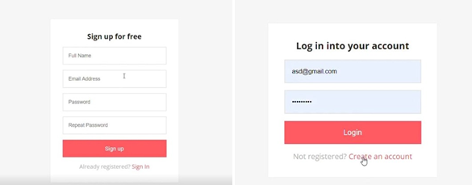
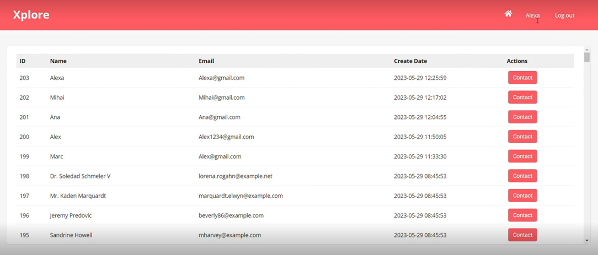
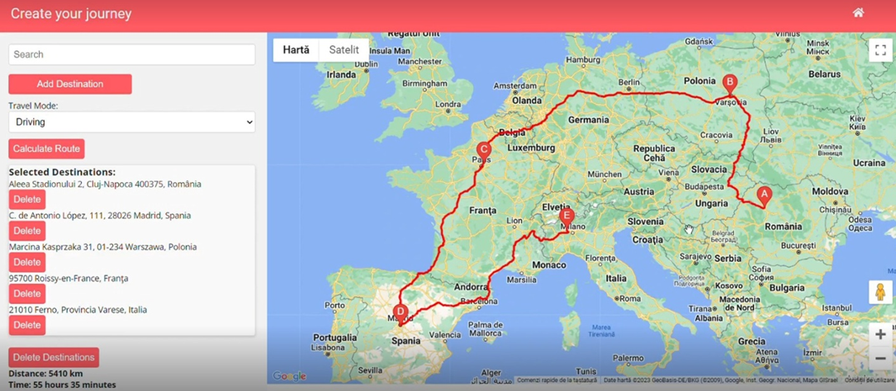
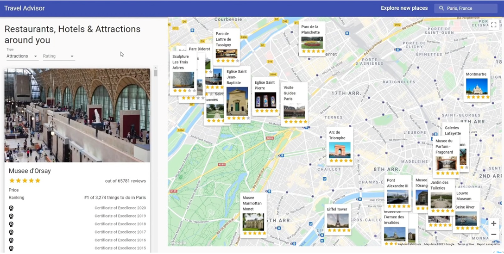
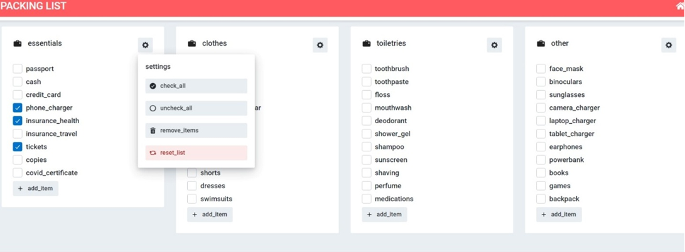

#  Xplore

### Introduction
Welcome to the Xplore application! Xplore is a comprehensive travel companion that combines both organizational and social aspects of travel to enhance your travel experiences. This readme file will provide you with an overview of the key features and functionalities of the Xplore application.

### Key Features

##### Social Interaction Social Interaction

- Connect with fellow travelers and share your experiences.

- Discover travel companions with similar interests and plans.

#####  Efficient Route Planning

- Plan your travel routes with ease.

- Find the most efficient routes to your destinations.

- Get real-time traffic updates and alternative routes.

##### Personalized Travel Experiences

- Customize your travel experience based on your preferences.

- Find accommodation, dining, and attraction options tailored to your taste.

- Receive personalized recommendations.

##### Packing Assistance

- Create packing lists for your trips.

- Get suggestions for what to pack.

- Stay organized and prepared for your travels.

### Usage

Once you have open Xplore, you have to **create an account** or **login.**

Now you can start using the application to enhance your travel experiences.

**- Make Friends(Connecting with Travelers)**: Use the social features to connect with other travelers, share your experiences, and get travel recommendations.

**- Organize a trip (Route Planning)**: When planning a trip, use the route planning functionality to find the most efficient routes to your destinations.

**- TravelAdvisor (Personalized Recommendations)**: Customize your travel experience by providing your preferences, and let Xplore recommend accommodation, dining, and attraction options that suit your tastes.

**- Packing:** Use the packing assistance module to create packing lists and stay organized when preparing for your trips.

